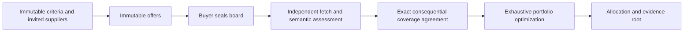

# EvidenceCover

**A cheap offer is useless if it leaves a requirement uncovered.** EvidenceCover clears a bounded reverse combinatorial auction over independently verified documentary capabilities. It selects the globally cheapest portfolio covering every buyer requirement.

[Verified StudioNet deployment and consensus receipts](proofs/README.md).

## Why consensus matters

Suppliers submit a price and a SHA-256 commitment to a commit-pinned public document. They do not submit coverage labels. The leader and validators each fetch the actual bytes and independently interpret every document against every requirement. Exact coverage-vector agreement authorizes the optimizer; one changed bit can change the winners or make the auction infeasible. Supporting quotes must occur in the fetched evidence.



## Concrete example

A buyer needs CSV parsing preserving quoted commas, and HTTP retrieval with retries and timeouts. Offers cost 4 for CSV, 5 for HTTP, and 12 for a combined bundle. Consensus derives coverage masks 1, 2, and 3. EvidenceCover selects the specialists for 9. With budget 8 it records OVER_BUDGET with no winners. An unsupported requirement produces UNCOVERABLE. Synthetic fixtures demonstrate the mechanism, not real vendor performance.

## Interface

| Method | Caller | Effect |
| --- | --- | --- |
| constructor(requirements_json, suppliers_json, budget) | Buyer | Fix 1–6 criteria, 1–8 suppliers and budget |
| submit_offer(url, sha256, cost) | Invited supplier | One immutable offer |
| seal() | Buyer | Freeze a nonempty board |
| clear() | Anyone | Acquire evidence, run consensus and select |
| get_auction() | Anyone | Read immutable inputs and phase |
| get_assessment() | Anyone | Read coverage decisions and quotes |
| get_allocation() | Anyone | Read winners, cost and evidence root |

OPEN → SEALED → CLEARED / OVER_BUDGET / UNCOVERABLE. Fetch, hash and LLM failures preserve SEALED, allowing retry. Terminal outcomes are immutable. The buyer controls closing; there is no deadline or secret-bid fairness guarantee.

## Repository guide

- contracts/evidence_cover.py — single-file deployable primitive
- tests/direct/ — state, failure and validator replay tests
- tests/integration/ — live deployment verification
- fixtures/ — labeled synthetic sources and adversarial text
- docs/consensus.md — validator target and threat boundaries
- proofs/ — deployment and finalized transaction evidence

## Reproduce

Use Python 3.12+ and the GenLayer CLI.

```sh
pip install -r requirements.txt
genvm-lint download --version v0.2.16
genvm-lint check contracts/evidence_cover.py --json
pytest tests/direct/ -v
genlayer network set studionet
```

Deploy from the repository root with `deploy/00_auction.js`. Set
`EVIDENCECOVER_REQUIREMENTS_JSON` to the JSON array of `{id, criterion}` records,
`EVIDENCECOVER_SUPPLIERS_JSON` to the JSON array of invited addresses, and
`EVIDENCECOVER_BUDGET` to an integer. Run `genlayer deploy`; the script passes the
JSON strings directly to the SDK and rejects unsuccessful execution. Set
`EVIDENCECOVER_ACCOUNT` and preload `scripts/cli-config.cjs` when selecting an
existing CLI account per process without changing global configuration:

```sh
node --require ./scripts/cli-config.cjs "$GENLAYER_CLI_PATH" deploy
EVIDENCECOVER_LIVE=1 gltest tests/integration/ -v
```

The process hook defaults to StudioNet. Set `EVIDENCECOVER_NETWORK=testnet-bradbury`
for public testnet deployment using a funded account. Published live proofs use
StudioNet; public testnet deployment requires GEN funding.

The Depends header pins an immutable GenVM runner. Read proofs before treating a deployment as verified. FINALIZED lifecycle and SUCCESS execution are checked separately.

## Scope

This is a procurement decision primitive with no escrow or token transfer. Costs use one buyer-defined integer unit. Selection does not prove delivery, ownership, security or payment. Hashes prevent substitution; they do not make a publisher truthful. Buyers choose invited counterparties and credible documents. Coverage is additive: compatibility, capacity and licensing are not inferred.

The implementation uses a distinct coverage-to-allocation mechanism relative to the previously discussed graph, certification, reconciliation and rate-compilation designs. Global novelty and submission scores are not guaranteed.

MIT licensed.
